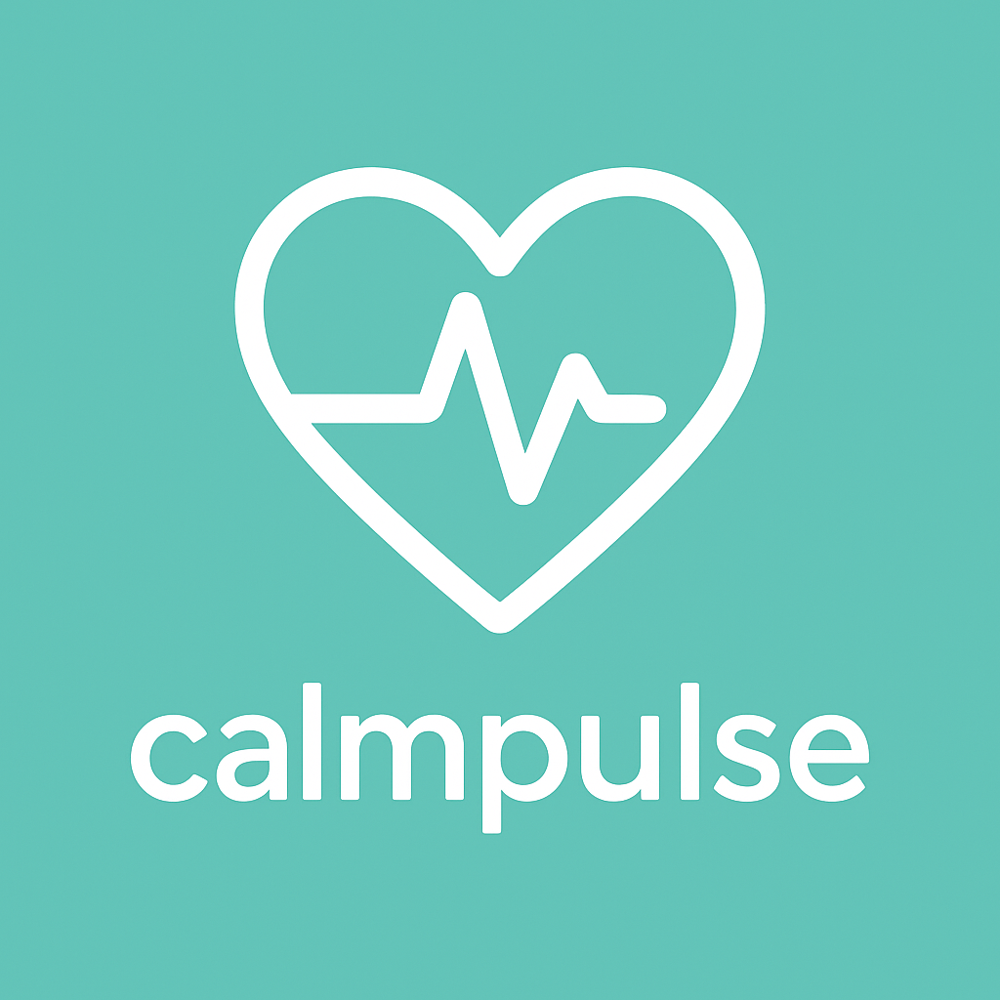

<p align="center">
  
</p>

<h1 align="center">CalmPulse — Smart Stress Tracker & Guide</h1>

<p align="center">
  <b>A real-time IoT-powered personal stress management and biometric monitoring mobile application built with React Native and Expo.</b>
</p>

<p align="center">
  <a href="https://stressmonitorapp.netlify.app/"></a>
</p>

<p align="center">
  <a href="https://reactnative.dev/"></a>
  <a href="https://expo.dev/"></a>
  <a href="https://www.typescriptlang.org/"></a>
  <a href="https://www.espressif.com/en/products/socs/esp32"></a>
  <a href="#license"></a>
  <a href="https://github.com/Aaqib-Proj/StressMonitorApp"></a>
</p>

---

## 🚀 Live Demo

Experience the full interactive CalmPulse interface directly in your browser:
👉 **[https://stressmonitorapp.netlify.app/](https://stressmonitorapp.netlify.app/)**

> [!TIP]
> **Mobile Preview:** For the authentic mobile app feel, press **`F12`** in your browser and toggle the **Device Toolbar** (`Ctrl + Shift + M`) to view it in an iPhone or Pixel frame.

---

## 📖 Overview

**CalmPulse** bridges wearable biometric sensing and mobile health technology. By connecting wirelessly to an **ESP32 microcontroller**, the application streams live physiological metrics—**Galvanic Skin Response (GSR)**, **Body Temperature**, and **Heart Rate Variability (HRV)**—to compute an accurate, age-adjusted, and humidity-compensated stress index in real-time.

Beyond real-time monitoring, CalmPulse acts as a complete **Personal Stress Management Assistant**, featuring diagnostic health breakdowns, session tracking, and a dedicated **Relaxation Hub** packed with guided breathwork, meditation, yoga, body scans, and soundscapes.

---

## ✨ Key Features

- **🌐 Real-Time Wireless IoT Streaming**  
  Communicates over Wi-Fi with an ESP32 microcontroller via high-speed HTTP polling, featuring automated connection timeout handling, reconnection retries, and network diagnostics.

- **🔬 Multi-Modal Biometric Sensor Fusion**  
  Simultaneously monitors:
  - **GSR (Galvanic Skin Response):** Captures autonomic nervous system arousal and sweat gland activity with dynamic ambient humidity compensation.
  - **Body Temperature:** Evaluates thermal regulation deviations against clinical baselines.
  - **Heart Rate Variability (HRV):** Measures parasympathetic activity with personalized age-bracket normalization.

- **🧠 Intelligent Weighted Stress Algorithm**  
  Computes a composite stress percentage (0–100%) and dynamically categorizes your state into **Normal (<40%)**, **Moderate (40–70%)**, or **High (>70%)** with color-coded circular progress visualizations.

- **🩺 Comprehensive Diagnostic Health Breakdown**  
  Tap any metric to access in-depth analysis modals complete with personalized health descriptions, status ratings, and instant recovery suggestions.

- **🧘 Dedicated Relaxation Hub**  
  Interactive, guided wellness sessions with curated media:
  - **4-7-8 Breathing Exercise:** Structured inhalation, retention, and exhalation cycles for nervous system calming.
  - **Meditation Guide:** Mindfulness sessions for mental decluttering.
  - **Calming Music:** Soothing soundscapes and nature frequencies.
  - **Body Scan Relaxation:** Head-to-toe guided muscle relaxation.
  - **Visualization Therapy:** Mental retreat imagery for rapid stress de-escalation.
  - **Yoga & Pranayama:** Asana instructions (*Balasana*, *Cat-Cow*) and Alternate Nostril Breathing (*Nadi Shodhana*).

- **📜 Local Session History & Persistence**  
  Stores previous monitoring sessions on-device using `@react-native-async-storage/async-storage` for private, offline tracking over time.

---

## 📐 Stress Calculation Methodology

CalmPulse uses a multi-factor mathematical model tailored for environmental conditions and demographic baselines:

```
Total Stress = (GSR Contribution × 0.20) + ((100 - AgeAdjustedHRV) × 0.40) + (Temp Contribution × 0.40)
```

### 1. Galvanic Skin Response (GSR) with Humidity Compensation
Skin conductance changes with ambient weather. CalmPulse balances raw sensor inputs (0–1023 ADC) using a relative humidity compensation factor:
```typescript
normalizedGSR = (gsr / 1023) * 100
humidityFactor = 1 - (humidity - 40) / 120   // Active in 40% - 100% RH
gsrContribution = normalizedGSR * humidityFactor
```

### 2. Age-Adjusted Heart Rate Variability (HRV)
HRV naturally varies by age. CalmPulse normalizes readings (0–150 ms) against age-bracketed baselines:
| Age Bracket | Baseline (ms) |
| :--- | :--- |
| **18 – 25** | `120 ms` |
| **26 – 35** | `110 ms` |
| **36 – 45** | `100 ms` |
| **46 – 55** | `90 ms` |
| **56 – 65** | `80 ms` |
| **65+** | `70 ms` |

### 3. Temperature Stress Contribution
| Temperature Range | Stress Contribution | Status |
| :--- | :--- | :--- |
| `30.0°C – 36.0°C` | `0` (Normal) | Optimal resting state |
| `36.1°C – 37.0°C` | `50` (Moderate) | Mild elevation |
| `< 30.0°C` | `50` (Moderate) | Hypothermic / peripheral vasoconstriction |
| `> 37.0°C` | `100` (High) | Hyperthermic / acute physical stress |

---

## 🔌 Hardware & IoT Architecture

```
+-------------------------------------------------------------+
|                     ESP32 Microcontroller                   |
|                                                             |
|  [ GSR Sensor ]       [ Temp Sensor ]       [ Pulse Sensor ]|
|  (Analog Pin)        (DS18B20 / LM35)          (MAX30102)   |
+------------------------------+------------------------------+
                               | Wi-Fi (Local LAN / Hotspot)
                               v
                       HTTP Web Server
             Endpoints: GET /  |  GET /data
                               |
                               v
+-------------------------------------------------------------+
|                     CalmPulse Mobile App                    |
|             (React Native + Expo SDK 53 Client)             |
+-------------------------------------------------------------+
```

### ESP32 JSON API Specification

The mobile client expects the ESP32 server to expose two endpoints on the local network:

#### 1. Health Check (`GET /`)
- **Response:** Plain text (e.g., `"ESP32 Stress Monitor Server Ready"`)
- **Status Code:** `200 OK`

#### 2. Biometric Stream (`GET /data`)
- **Headers:** `Accept: application/json`
- **Payload Schema:**
```json
{
  "gsr": 512,
  "temp": 36.4,
  "hrv": 78,
  "humidity": 55.0
}
```

| Field | Type | Description |
| :--- | :--- | :--- |
| `gsr` | `number` | Raw or mapped GSR analog value (`0 - 1023`) |
| `temp` | `number` | Skin or body temperature in degrees Celsius (`°C`) |
| `hrv` | `number` | Heart Rate Variability / RMSSD in milliseconds (`ms`) |
| `humidity` | `number` | *(Optional)* Relative ambient humidity percentage (`%`) |

---

## 📱 Relaxation Modules Showcase

| Breathing Exercise | Meditation Guide | Yoga & Pranayama |
| :---: | :---: | :---: |
|  |  |  |
| **Calming Music** | **Body Scan** | **Visualization** |
|  |  |  |

---

## 🗂 Project Structure

```
StressMonitorApp/
├── app/
│   ├── (tabs)/
│   │   ├── _layout.tsx           # Tab bar configuration (Home & Relaxation Hub)
│   │   ├── index.tsx             # Main dashboard, ESP32 connector & biometric logic
│   │   └── RelaxationHub.tsx     # Relaxation activities and guided modalities
│   ├── _layout.tsx               # Root layout & theme providers
│   ├── +not-found.tsx            # 404 handler
│   └── styles/
│       └── styles.ts             # Centralized design system & component styles
├── assets/
│   ├── fonts/                    # Custom application typography
│   └── images/                   # App logos, icon assets & relaxation guides
├── components/                   # Reusable UI primitives (HapticTab, ThemedView, etc.)
├── constants/                    # Color schemes and app-wide constants
├── hooks/                        # Custom React hooks (useColorScheme, etc.)
├── app.json                      # Expo application manifest
├── eas.json                      # EAS Build configuration (APK & Bundle profiles)
├── package.json                  # Dependencies & script definitions
└── tsconfig.json                 # TypeScript compiler configuration
```

---

## 🚀 Getting Started
 
> [!NOTE]
> Want to preview the UI without local setup? Visit the live web deployment at **[stressmonitorapp.netlify.app](https://stressmonitorapp.netlify.app/)**.
 
### Prerequisites

- [Node.js](https://nodejs.org/) (version 18+ recommended)
- [npm](https://www.npmjs.com/) or [yarn](https://yarnpkg.com/)
- [Expo Go](https://expo.dev/go) app installed on your physical mobile device (Android or iOS)
- An **ESP32 microcontroller** running the web server on your local Wi-Fi / Hotspot *(optional for UI testing)*

### Installation

1. **Clone the repository:**
   ```bash
   git clone https://github.com/Aaqib-Proj/StressMonitorApp.git
   cd StressMonitorApp
   ```

2. **Install dependencies:**
   ```bash
   npm install
   ```

3. **Start the development server:**
   ```bash
   npx expo start
   ```

4. **Launch on your device:**
   - Scan the QR code displayed in your terminal using **Expo Go** (Android) or the default Camera app (iOS).
   - Press `a` to run on an connected Android Emulator.
   - Press `w` to run on Web.

---

## 📲 Connecting to your ESP32

1. Ensure your smartphone and your ESP32 are connected to the **same Wi-Fi network** (or connect your ESP32 to your phone's mobile hotspot).
2. Note the local IP address assigned to the ESP32 (e.g., `192.168.1.100` or `192.168.43.50`).
3. Open **CalmPulse**, enter your Name and Age on the welcome screen.
4. Tap **"Connect to device"** on the dashboard.
5. Enter the ESP32 IP address and tap **Connect**.
6. Once connected, tap **"Start Monitoring"** to stream live biometric readings!

---

## 📦 Building Standalone Binaries (APK)

This project is pre-configured with **Expo Application Services (EAS)** for building production and test binaries.

1. **Install EAS CLI:**
   ```bash
   npm install -g eas-cli
   ```

2. **Log in to your Expo account:**
   ```bash
   eas login
   ```

3. **Build an Android APK (Preview):**
   ```bash
   eas build --platform android --profile preview
   ```
   *This outputs an installable `.apk` file directly on your Expo dashboard.*

4. **Build an Android App Bundle (Production for Play Store):**
   ```bash
   eas build --platform android --profile production
   ```

---

## 🛠 Tech Stack & Libraries

- **Framework:** [React Native](https://reactnative.dev/) (0.79.3) with [Expo](https://expo.dev/) (SDK 53)
- **Routing:** [Expo Router v5](https://docs.expo.dev/router/introduction/) (file-based navigation)
- **Language:** [TypeScript](https://www.typescriptlang.org/)
- **Visual Gauges:** [`react-native-circular-progress`](https://github.com/bartgryszko/react-native-circular-progress) & [`react-native-svg`](https://github.com/software-mansion/react-native-svg)
- **Icons:** [`@expo/vector-icons`](https://docs.expo.dev/guides/icons/) (FontAwesome6, Ionicons)
- **State & Storage:** [`@react-native-async-storage/async-storage`](https://react-native-async-storage.github.io/async-storage/)
- **Build System:** [EAS Build](https://docs.expo.dev/build/introduction/)

---

## 🤝 Contributing

Contributions, issues, and feature requests are welcome!

1. Fork the Project
2. Create your Feature Branch (`git checkout -b feature/AmazingFeature`)
3. Commit your Changes (`git commit -m 'Add some AmazingFeature'`)
4. Push to the Branch (`git push origin feature/AmazingFeature`)
5. Open a Pull Request

---

## 📄 License

This project is open-source and available under the [MIT License](LICENSE).
